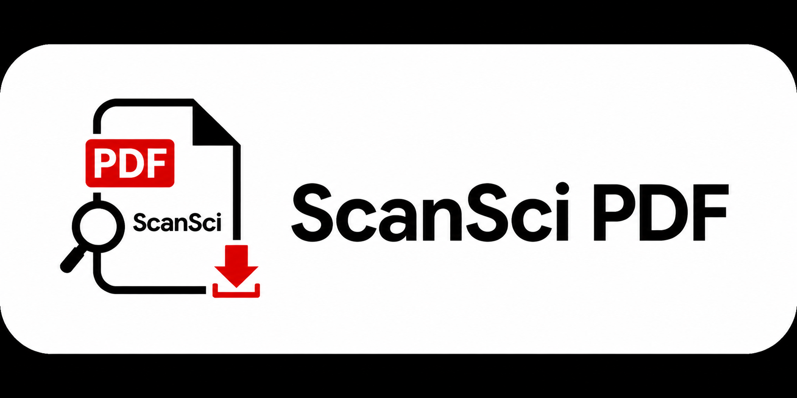

<p align="center">
  
</p>

<p align="center">
  <a href="https://pypi.org/project/scansci-pdf/"></a>
  <a href="https://pypi.org/project/scansci-pdf/"></a>
  <a href="LICENSE"></a>
  <a href="https://modelcontextprotocol.io"></a>
</p>

ScanSci PDF 是一个用于获取学术论文 PDF 的项目，提供 Python 包、命令行工具 和 MCP 服务，并把官方 OA 渠道、灰色渠道（Sci-Hub/LibGen/SciBban）和机构渠道（WebVPN/CARSI/EZProxy/浏览器 SSO）组织到同一套并行竞速与回退流程中。

---

## 项目范围

- **多入口使用** — 可作为 Python 包、`scansci-pdf` 命令行工具、浏览器 Web UI 或 MCP 服务使用
- **开放/官方渠道** — 出版商直链、arXiv、Unpaywall、OpenAlex、Semantic Scholar、DOAJ、EuropePMC、CORE、PMC 等
- **灰色渠道** — Sci-Hub、LibGen、SciBban 等作为开放源失败或网络受限时的候选源，可结合 Tor 与 CloakBrowser
- **机构渠道** — 100+ 高校 WebVPN、CARSI、EZProxy、浏览器 SSO，用于有合法机构账号的付费墙访问，CAS/SSO 密码不经过工具
- **浏览器流程** — 可选 CloakBrowser 处理 Cloudflare/CAPTCHA/SSO、持久化 profile 和出版商页面下载
- **批量与元数据** — 支持 APA 引文、BibTeX、DOI 列表解析，批量下载、自动重命名、BibTeX/RIS/EndNote 引文导出
- **诊断与配置** — 检查依赖、数据源延迟、代理、Tor、浏览器状态，并给出修复建议

---

## 快速开始

### 安装

```bash
pip install scansci-pdf
```

需要 WebVPN/CARSI/EZProxy 登录、付费墙浏览器下载或 Cloudflare 绕过时，安装可选浏览器和机构访问依赖：

```bash
pip install "scansci-pdf[cloakbrowser,instsci]"
```

### 命令行使用

如果不通过 MCP，也可以直接使用 `scansci-pdf` CLI：

```bash
# 直接下载 DOI/arXiv
scansci-pdf get 10.1038/nature12373

# 使用机构访问级联下载
scansci-pdf fetch 10.1038/nature12373 --format markdown

# 批量下载，每行一个 DOI 或 URL
scansci-pdf batch dois.txt --output downloads

# 启动浏览器 Web UI
scansci-pdf web --port 8080

# 浏览器登录并保存 cookie
scansci-pdf login --login-type cookies --url https://www.sciencedirect.com/

# 配置机构访问、查看浏览器状态、配置 Elsevier API
scansci-pdf setup 北京大学
scansci-pdf browser-status
scansci-pdf elsevier-setup --api-key YOUR_KEY
```

### 检查环境

```bash
scansci-pdf check
```

### MCP 配置

在任何支持 MCP 的 Agent 中添加以下配置即可使用：

```json
{
  "mcpServers": {
    "scansci-pdf": {
      "command": "scansci-pdf",
      "args": ["run"]
    }
  }
}
```

支持 MCP 的 Agent 和客户端：

| 客户端 | 说明 |
|--------|------|
| Claude Desktop | Anthropic 官方桌面客户端 |
| Claude Code | Anthropic 命令行 Agent |
| Cursor | AI 代码编辑器 |
| Windsurf | AI 代码编辑器 |
| Cline | VS Code 插件 Agent |
| Cherry Studio | 多模型桌面客户端 |
| OpenClaw | MCP 客户端 |
| 任何 MCP 兼容客户端 | MCP 是开放协议，任何实现均可接入 |

<details>
<summary>HTTP 模式（远程/Web 调用）</summary>

适用于远程部署或不支持 stdio 的场景：

```bash
scansci-pdf run --mode streamable_http --host 0.0.0.0 --port 8000
```
</details>

---

## 工作原理

下载一篇论文时，ScanSci PDF 会同时启动多个数据源，按渠道类型和优先级分层竞速：

```
Tier 1 (4s)  ─ 开放/官方：出版商直链（OA/已授权访问）
Tier 2 (5s)  ─ 开放/官方：OpenAlex / Unpaywall / DOAJ
Tier 3 (8s)  ─ 开放/官方：EuropePMC / CORE / PMC / arXiv
Tier 4 (25s) ─ 灰色渠道：LibGen / Sci-Hub / SciBban（可结合 Tor / CloakBrowser）
Tier 5 (20s) ─ 机构渠道：WebVPN / CARSI / EZProxy / 浏览器 SSO
```

首个成功下载的源立即返回，其余自动取消。自适应评分系统会根据历史成功率和延迟动态调整源的优先级。

---

## MCP 工具

本节中的 `scansci_pdf_*` 是 MCP 工具名，用于在支持 MCP 的 Agent 或客户端内调用；终端命令请使用上一节的 `scansci-pdf ...` CLI。

### 论文下载

| 工具 | 描述 |
|------|------|
| `scansci_pdf_smart_download` | 自动尝试所有源 + Tor 的直接下载 |
| `scansci_pdf_download` | 下载单篇论文（完整参数控制） |
| `scansci_pdf_batch_download` | 批量下载多篇论文 |
| `scansci_pdf_resolve_and_download` | 解析列表 → 补全 DOI → 批量下载 |

### 付费墙登录

| 工具 | 描述 |
|------|------|
| `scansci_pdf_login` | 统一登录：输入 DOI 自动识别出版商并打开浏览器 SSO |
| `scansci_pdf_browser_login` | CloakBrowser 持久化浏览器登录 |
| `scansci_pdf_browser_status` | 检查 CloakBrowser 状态 |
| `scansci_pdf_browser_import_cookies` | 导入 Netscape cookie 到浏览器 |
| `scansci_pdf_import_browser_cookies` | 打开浏览器捕获登录 cookie |

### 搜索与解析

| 工具 | 描述 |
|------|------|
| `scansci_pdf_search` | 按关键词搜索论文（OpenAlex） |
| `scansci_pdf_parse_list` | 解析 APA/BibTeX/DOI 列表文件 |

### 引文管理

| 工具 | 描述 |
|------|------|
| `scansci_pdf_citation` | 获取论文引文（BibTeX/RIS/EndNote） |
| `scansci_pdf_import_bib` | 导入 .bib 文件并下载全部论文 |
| `scansci_pdf_paper_metadata` | 获取论文元数据 |
| `scansci_pdf_zotero_push` | 将已下载论文推送到 Zotero |

### 机构代理（WebVPN / CARSI / EZProxy）

| 工具 | 描述 |
|------|------|
| `scansci_pdf_instsci_set_school` | 设置 WebVPN 学校 |
| `scansci_pdf_instsci_login` | WebVPN 浏览器 CAS 认证 |
| `scansci_pdf_instsci_status` | WebVPN 登录状态 |
| `scansci_pdf_instsci_schools` | 搜索支持的大学 |
| `scansci_pdf_instsci_test` | 测试 WebVPN 连接性 |
| `scansci_pdf_carsi_login` | CARSI 出版商机构登录 |
| `scansci_pdf_carsi_status` | CARSI 状态与 cookie 检查 |
| `scansci_pdf_ezproxy_login` | EZProxy 图书馆代理登录 |
| `scansci_pdf_ezproxy_status` | EZProxy 状态检查 |

### 系统管理

| 工具 | 描述 |
|------|------|
| `scansci_pdf_auto_setup` | 环境检测与自动配置 |
| `scansci_pdf_setup_check` | 检测系统环境并给出安装建议 |
| `scansci_pdf_health_check` | 检查所有数据源可用性与延迟 |
| `scansci_pdf_network_diagnose` | 网络诊断 + 修复建议 |
| `scansci_pdf_source_scores` | 各数据源历史成功率排名 |
| `scansci_pdf_config_get` / `scansci_pdf_config_set` | 查看/修改配置 |
| `scansci_pdf_cache_clear` | 清除下载缓存 |
| `scansci_pdf_browser_doctor` | 检查可复用浏览器运行时 |
| `scansci_pdf_elsevier_setup` | 配置或验证 Elsevier API Key |

### Tor 管理

| 工具 | 描述 |
|------|------|
| `scansci_pdf_tor_install` | 自动下载安装 Tor Expert Bundle |
| `scansci_pdf_tor_start` | 启动内嵌 Tor SOCKS5 代理 |
| `scansci_pdf_tor_stop` | 停止 Tor 代理 |

---

## 下载流程

下载采用两阶段模式，先跑开放/官方与灰色渠道，再在需要时进入机构渠道：

1. **Phase 1 — 开放/官方 + 灰色渠道并行竞速**（15s 超时）：出版商直连、OA API（Unpaywall/OpenAlex/SemanticScholar/DOAJ/EuropePMC/CORE/PMC）、arXiv、Sci-Hub、LibGen、SciBban、浏览器源
2. **Phase 2 — 机构渠道回退**（30s 超时）：仅当 Phase 1 全部失败时触发，通过 instsci 桥接、CARSI、WebVPN、EZProxy 或浏览器 SSO 获取

---

## 付费墙：机构登录

以下示例使用 MCP 工具调用语法；终端 CLI 对应命令见“命令行使用”。

### 统一登录

只需一行，自动识别出版商、打开浏览器、引导完成 SSO 登录，cookie 跨所有下载复用：

```
scansci_pdf_login(identifier="10.1126/science.aec6396")
```

`identifier` 可以是 DOI 或出版商名（`elsevier`, `wiley`, `nature`, `springer`, `ieee`, `science`, `tandfonline`, `acs`, `rsc`, `aip`, `aps`, `iop`, `oxford`, `acm`）。

### WebVPN（高校代理）

通过中国高校机构代理访问论文全文：

```
1. scansci_pdf_instsci_schools(query="北京")      → 搜索学校
2. scansci_pdf_instsci_set_school(school="你的学校")
3. scansci_pdf_instsci_login                     → 浏览器 CAS 认证
4. scansci_pdf_instsci_test                      → 确认连接正常
```

支持 100+ 所高校。

### CARSI（出版商联邦认证）

直接通过出版商机构登录页面认证，无需 WebVPN 中转：

```
1. scansci_pdf_config_set(key="carsi_enabled", value="true")
2. scansci_pdf_config_set(key="carsi_idp_name", value="你的学校名称")
3. scansci_pdf_carsi_login(publisher="sciencedirect")
```

支持：sciencedirect, springer, wiley, ieee, tandfonline, nature

### EZProxy（图书馆代理）

通过学校图书馆 EZProxy 服务访问：

```
1. scansci_pdf_config_set(key="ezproxy_enabled", value="true")
2. scansci_pdf_config_set(key="ezproxy_login_url", value="https://libproxy.你的学校.edu.cn/login?url={url}")
3. scansci_pdf_ezproxy_login
```

---

## 配置参考

MCP 内通过 `scansci_pdf_config_set(key="...", value="...")` 修改；终端 CLI 可用 `scansci-pdf config-cmd key value` 修改。

| 配置项 | 默认值 | 说明 |
|--------|--------|------|
| `scihub_enabled` | `true` | 启用 Sci-Hub |
| `output_dir` | `~/.scansci-pdf/papers` | PDF 输出目录 |
| `auto_rename` | `true` | 自动重命名 PDF |
| `network_proxy` | （空） | HTTP/SOCKS 代理地址 |
| `batch_workers` | `10` | 批量下载并发数 |
| `instsci_enabled` | `false` | 启用 WebVPN |
| `instsci_school` | （空） | WebVPN 学校名称 |
| `carsi_enabled` | `false` | 启用 CARSI 联邦认证 |
| `carsi_idp_name` | （空） | CARSI 机构名称 |
| `browser_headless` | `false` | CloakBrowser 无头模式 |
| `browser_humanize` | `true` | CloakBrowser 反检测人性化 |
| `use_tor_for_scihub` | `true` | Sci-Hub 使用 Tor（明网失败后自动回退 .onion） |

---

## 高级功能（可选）

以下功能为可选项，适用于特定网络环境或高级需求。

### Elsevier API Key（ScienceDirect API）

项目内置 Elsevier Retrieval API 通道。配置 API Key 后，ScienceDirect/Elsevier 论文会优先尝试 API 下载；是否能直接取得 PDF 仍取决于 API 权限、机构 token 或论文开放状态，失败时会回退到浏览器/机构访问流程。

MCP 工具：

```
1. scansci_pdf_elsevier_setup
2. scansci_pdf_config_set(key="elsevier_api_key", value="YOUR_KEY")
3. scansci_pdf_elsevier_setup(test=true)
```

终端 CLI：

```bash
scansci-pdf elsevier-setup --api-key YOUR_KEY
```

### Docker 部署

适用于需要将 scansci-pdf 作为长期运行服务的场景，或不想在本机安装 Python 环境的用户。Docker 容器内置 MCP 服务器和 Tor 代理，数据通过 Docker 卷持久化。

```bash
docker compose up -d
```

| 服务 | 说明 | 端口 |
|------|------|------|
| `scansci-pdf` | streamable HTTP MCP 服务器 | 8000 |
| `tor` | Tor SOCKS5 代理 | 1080 |

Docker 启动后会暴露 streamable HTTP MCP 服务。支持远程 MCP 的客户端可连接本机 `8000` 端口；如果客户端只支持 stdio，建议使用本地安装后的 `scansci-pdf run`。

具体 URL 字段因客户端而异，通常指向 `http://localhost:8000/mcp`。

### Tor 匿名代理

Tor 用于在 Sci-Hub、LibGen 等网站被网络封锁的地区匿名访问。如果你的网络可以直连 Sci-Hub，则不需要 Tor。内嵌 Tor 会自动下载 Tor Expert Bundle（约 30MB），无需 Docker 或系统级安装。以下为 MCP 工具调用示例：

```
# 首次使用：自动下载安装 Tor
scansci_pdf_tor_install

# 启动 Tor SOCKS5 代理
scansci_pdf_tor_start

# 如果 Tor 本身也被封锁（连接超时），启用 obfs4 桥接绕过
scansci_pdf_tor_start(use_bridges=true)

# 下载时通过 Tor 访问
scansci_pdf_download(identifier="10.1038/nature12373", use_tor=true)
```

二进制文件存储在 `~/.scansci-pdf/tor/`，不污染系统环境。

### CloakBrowser（Cloudflare 绕过）

当 Sci-Hub、LibGen 或出版商页面触发 Cloudflare/CAPTCHA/SSO 流程时，CloakBrowser 可提供可见浏览器会话和持久化 profile。它是可选依赖，不随基础安装强制安装：

```bash
pip install "scansci-pdf[cloakbrowser]"
scansci-pdf browser-doctor
```

---

## 故障排查

**Sci-Hub 下载失败** — 在 MCP 中运行 `scansci_pdf_health_check(detailed=true)` 查看数据源状态。域名轮换会自动处理。如果遇到 Cloudflare 防护，安装可选 CloakBrowser 并运行 `scansci-pdf browser-status` 检查可用性。

**Tor 连接失败** — 确认 Tor 运行在 `socks5h://127.0.0.1:1080`。如 Tor 也被封锁，使用 `scansci_pdf_tor_start(use_bridges=true)` 启用桥接。

**WebVPN 登录失败** — 需要 CloakBrowser 与 WebVPN 加密依赖：`pip install "scansci-pdf[cloakbrowser,instsci]"`。登录在可见浏览器中完成，密码不经过本工具。

**下载速度慢** — 运行 `scansci_pdf_health_check(detailed=true)` 检查数据源延迟。如 Sci-Hub 在你的网络被封锁，配置代理或禁用 Sci-Hub（`scansci_pdf_config_set(key="scihub_enabled", value="false")`）。

**网络问题** — 运行 `scansci_pdf_network_diagnose` 获取全面的连接诊断报告和针对性修复建议。

---

## 架构说明

本项目采用分层架构：

| 层级 | 内容 | 许可 |
|------|------|------|
| 公开层 | 所有 `.py` 源码、配置、文档 | Apache 2.0 |
| 保护层 | `_core/*.pyx`（Cython 源码） | 专有，不公开 |
| 分发层 | `_core/*.pyd`（编译二进制） | 随 PyPI 包分发 |

从 GitHub 克隆的用户使用纯 Python 回退实现（功能相同，性能略低）。从 PyPI 安装的用户自动获得编译版本。

---

## 赞助者

<a href="https://github.com/qwlei328-maker"></a>
<a href="https://github.com/jingqingqiu1"></a>
<a href="https://github.com/minqifeng"></a>

---

## 致谢

本项目在开发过程中参考和借鉴了以下开源项目：

- **[FlareSolverr](https://github.com/FlareSolverr/FlareSolverr)** — 早期反 bot 绕过架构设计（Docker 容器方案）
- **[CloakBrowser](https://github.com/CloakHQ/CloakBrowser)** — Chromium stealth 浏览器，直接 Playwright API（当前方案）
- **[cloakbrowser](https://github.com/CloakHQ/CloakBrowser)** — 原生 Chromium stealth 浏览器引擎（当前方案，本地 Python 库，无需 Docker）
- **[ref-downloader](https://github.com/ltczding-gif/ref-downloader)** — Publisher 专用下载策略（Elsevier crasolve 检测、Wiley PDFDirect、AIP loading page 等）
- **[paper-fetch-skill](https://github.com/Dictation354/paper-fetch-skill)** — 论文获取 Agent Skill 设计
- **[paper-fetcher](https://github.com/fermionoid/paper-fetcher)** — 论文下载流程参考

> **技术演进**：反 Cloudflare 方案经历了两代迭代 — FlareSolverr（Docker 容器）→ CloakBrowser（本地 Python 库），逐步从重型 Docker 依赖转向轻量本地集成。

感谢以上项目作者的开源贡献。

---

## 许可证

[Apache License 2.0](LICENSE)

例外：`src/scansci_pdf/_core/` 中的 Cython 编译扩展（`.pyd`/`.so`）为预编译二进制，仅通过 PyPI 分发。其 Cython 源码（`.pyx`）为专有代码，不包含在本仓库中。
